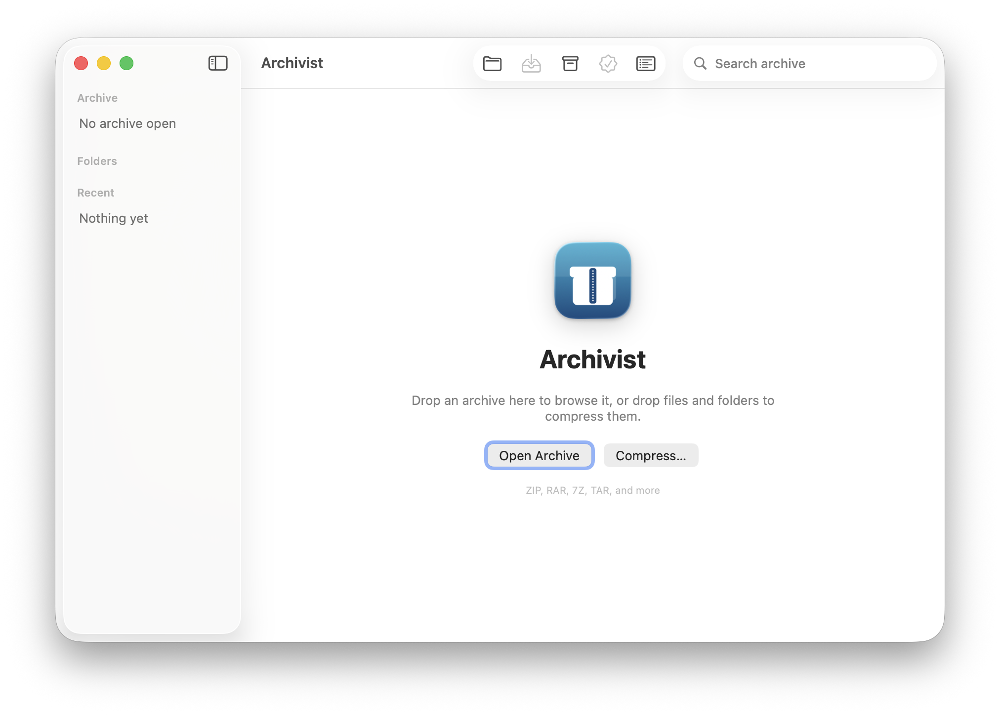
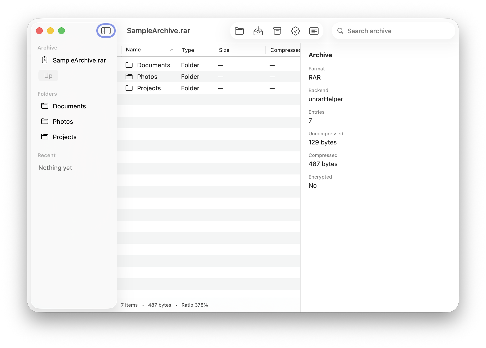
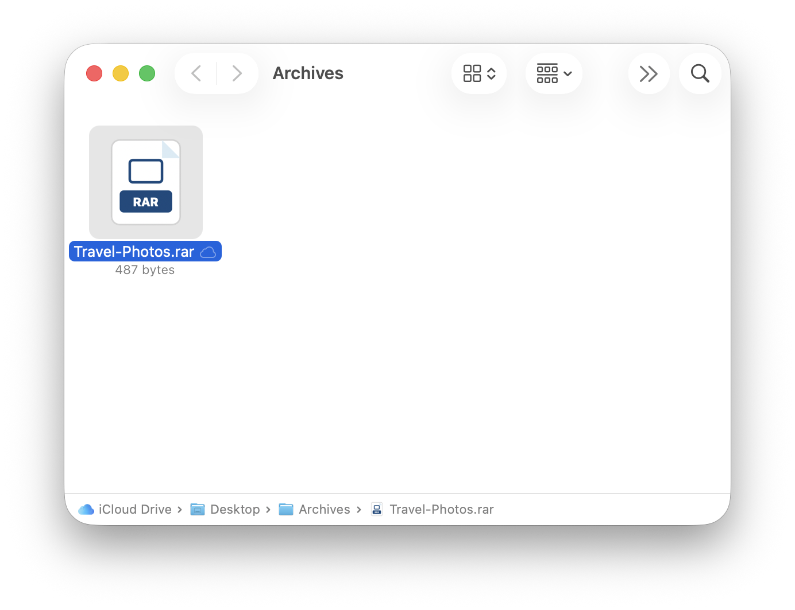

<p align="center">
  
</p>

<h1 align="center">Archivist: native macOS archive manager</h1>

<p align="center">
  <a href="https://github.com/MoomenALdahdouh/Archivist/actions/workflows/test.yml"></a>
  <a href="https://github.com/MoomenALdahdouh/Archivist/releases/latest"></a>
  <a href="LICENSE"></a>
  
  
</p>

<p align="center">
  <a href="https://github.com/MoomenALdahdouh/Archivist/releases/latest"><strong>Download Archivist 1.0.0</strong></a>
  · Apple Silicon · macOS 14+
</p>

---

## Overview

Archivist lists, extracts, creates, and tests archives on macOS. The SwiftUI app and the `archivemgr` CLI share one engine: streaming I/O, real progress, cancellation, and Zip Slip protection.

Supported formats include ZIP, RAR, 7Z, TAR, and related containers. RAR create and extract use official RARLAB command-line helpers. Archivist is not WinRAR and does not reimplement RAR compression.

<p align="center">
  
</p>

<p align="center">
  
</p>

<p align="center">
  
</p>

## Installation

### Disk image (Apple Silicon)

1. Download **Archivist-1.0.0.dmg** from [Releases](https://github.com/MoomenALdahdouh/Archivist/releases/latest).
2. Drag **Archivist** into **Applications**.
3. Right-click the app → **Open** (first launch only). The public build is ad-hoc signed, not notarized.

Requires **macOS 14+** on Apple Silicon. Intel Macs should build from source.

### From source

```bash
git clone https://github.com/MoomenALdahdouh/Archivist.git
cd Archivist

# Homebrew + Swift 6 toolchain (Xcode or Command Line Tools)
./Scripts/install.sh
```

`install.sh` installs `libarchive` and helpers, builds a release app with libraries bundled inside the `.app`, and copies it to `/Applications`. After that, Homebrew is not required at runtime.

```bash
./Scripts/build.sh            # debug
./Scripts/test.sh             # ArchiveTestRunner
./Scripts/package-app.sh      # dist/Archivist.app
./Scripts/release.sh          # dist/Archivist-<version>.dmg
```

See [BUILD.md](BUILD.md) for signing, notarization, and layout.

## Usage

The CLI is inside the app bundle and uses the same engine:

```bash
/Applications/Archivist.app/Contents/MacOS/archivemgr list archive.zip
/Applications/Archivist.app/Contents/MacOS/archivemgr inspect archive.rar
/Applications/Archivist.app/Contents/MacOS/archivemgr extract archive.zip ./output
/Applications/Archivist.app/Contents/MacOS/archivemgr create ./folder archive.zip --format zip
/Applications/Archivist.app/Contents/MacOS/archivemgr create ./folder archive.rar --format rar
/Applications/Archivist.app/Contents/MacOS/archivemgr test archive.7z
/Applications/Archivist.app/Contents/MacOS/archivemgr formats
```

From a checkout: `swift run archivemgr …` (Homebrew libarchive required). Options and exit codes: [docs/CLI.md](docs/CLI.md).

### Finder

Open Archivist once, then right-click files under **Quick Actions** or **Services**:

- Extract with Archivist
- Compress with Archivist (ZIP)
- Compress to RAR with Archivist
- Compress to 7Z with Archivist

Enable missing items in **System Settings → Keyboard → Keyboard Shortcuts → Services → Files and Folders**. Double-click an archive, or drop files onto the window.

## Features

- Browse without extracting; extract all or selected entries
- Create ZIP, RAR, 7Z, TAR, and compressed TAR / single-file formats
- Password-protected RAR, ZIP, and 7Z
- Job queue with byte progress, speed, and ETA
- Zip Slip / symlink / decompression-bomb checks
- Offline; no telemetry

Format matrix: [docs/SUPPORTED_FORMATS.md](docs/SUPPORTED_FORMATS.md). Architecture: [docs/ARCHITECTURE.md](docs/ARCHITECTURE.md).

## Development

```bash
./Scripts/build.sh && ./Scripts/test.sh
```

Keep format logic in `ArchiveCore` / `ArchiveBackends`, not in SwiftUI views. Do not reimplement RAR compression or use UnRAR sources to create RAR archives.

Contributing: [CONTRIBUTING.md](CONTRIBUTING.md). Troubleshooting: [docs/TROUBLESHOOTING.md](docs/TROUBLESHOOTING.md).

## Support

If Archivist is useful, you can [buy me a coffee](https://ko-fi.com/moomenaldahdouh).

[](https://ko-fi.com/moomenaldahdouh)

## License

[MIT](LICENSE) for Archivist source. Third-party terms: [THIRD_PARTY_LICENSES.md](THIRD_PARTY_LICENSES.md).
